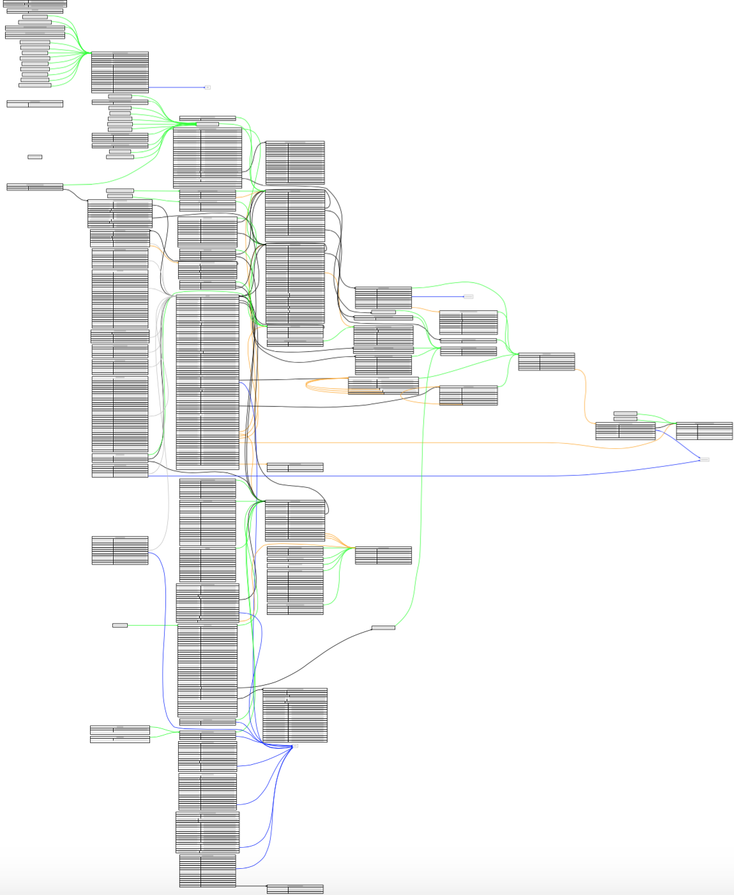

# atgviz
Simple tool which generates .dot file from ATG repository (GSA) xml file.

### Dependencies
* Reporitory schemas are reversed from ATG9.2 dynamosystemresource:/atg/dtds/gsa/gsa_1.0.dtd
* Requeres graphviz to gnerate human friendly format

### Connection Colors
- _black_ - internal one-one reference
- _orange_ - internal one-many reference
- _blue_ - external repository reference
- _green_ - subtype inherittance

### Usage Example
1. In *Configuration.groovy* Set which repository xml to vizualize
2. Run Launcher.groovy - a list of .dot file will appear as output
3. Run graphviz for final transformation (see gen-pdf.cmd or gen-svg.cmd)
```
dot -Tpdf ProfileAdapterRepository.dot -o ProfileAdapterRepository.pdf
```
4. See what a mess happened ;)


